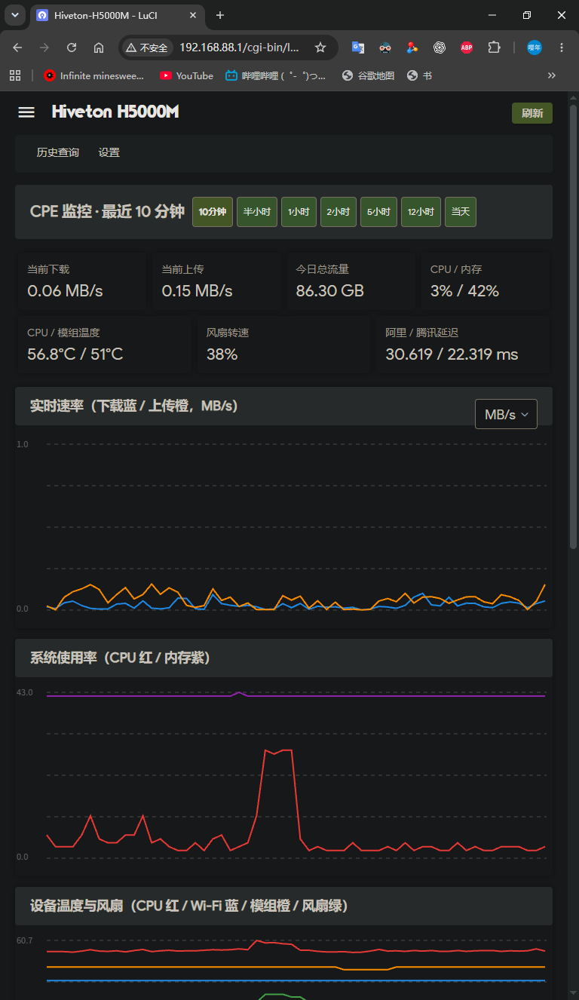

# CPE Monitor for ImmortalWrt — CPE 网络监控插件

面向 Hiveton H5000M / ImmortalWrt 24.10 的轻量监控插件。

当前版本：**v1.4.0**。安装包与源码见 [GitHub Releases](https://github.com/xiaokeikei/luci-app-cpemonitor/releases/latest)。

## 界面预览



## 指标

- WAN 每日上行、下行及总流量（零点结算）
- 实时上行/下行速度
- CPU、内存、根分区使用率与系统负载
- CPU、Wi-Fi、FM160 模组温度及风扇 PWM 转速百分比
- 阿里云/腾讯云延迟和丢包
- 5G RSRP、RSRQ、SINR、网络制式及频段

原始样本先写入 `/tmp/cpemonitor`，默认每 6 小时批量同步到持久存储，减少闪存写放大。每日流量状态也在同步时建立检查点。

## 安装

推荐下载 Release 中的 IPK 安装或升级：

```sh
opkg install ./luci-app-cpemonitor_1.4.0-1_all.ipk
```

也可下载自解压安装包，执行 `sh luci-app-cpemonitor-1.4.0-1.run`。
升级后若页面仍显示旧版，请按 **Ctrl+F5** 强制刷新浏览器缓存。

上传并解压后，在插件目录执行：

```sh
chmod +x install.sh
./install.sh
```

LuCI 菜单：`状态 → CPE 监控`。

- `CPE 监控`：默认滚动显示最近 10 分钟，标题栏可切换最近半小时、1/2/5/12 小时及当天（零点至当前）；所有监控图表同步切换，自动刷新保留所选范围
- `历史查询`：按日期和起止时间查询，长时间段自动抽样

时间按钮会同步切换速率、CPU/内存、温度/风扇、网络延迟和 5G 信号图表。
当天范围使用浏览器本地时间零点；当前状态卡片始终显示最新值，每日流量表不受筛选影响。
长时间范围由后端自动抽样，最多约 1200 个点；没有采集到的数据不会补齐。

## v1.4.0 验证

- JavaScript 语法及七个时间范围、按钮选中状态、自动刷新和过期请求处理检查通过。
- Hiveton H5000M / FM160-CN 实机 SSH 验证七个范围均返回对应时间内的样本，采样服务正常。
- 更新记录见 [CHANGELOG.md](CHANGELOG.md)。

## 打包

在源码目录运行 `python tools/build_release.py`（Python 3），产物输出到上一级的 `versions/v1.4.0/`，包括 IPK、自解压安装包、源码 ZIP 和 SHA256 校验文件。

## 默认设置

- 基础采样：10 秒
- 模组采样：60 秒（AT/ubus 查询较重）
- 持久化：6 小时
- 保留：365 天
- WAN 接口：`wwan0`
- 持久目录：`/overlay/cpemonitor`

所有周期、接口、探测地址和保留天数均可在 LuCI 设置页修改。
