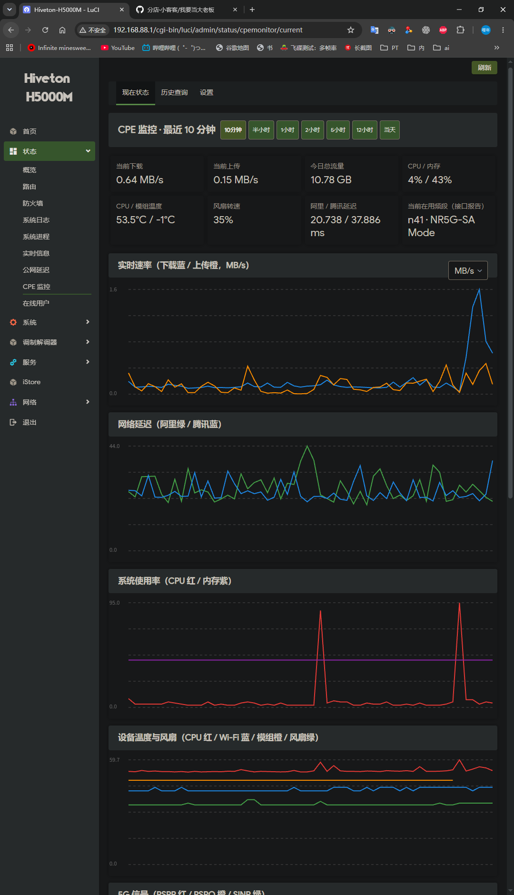
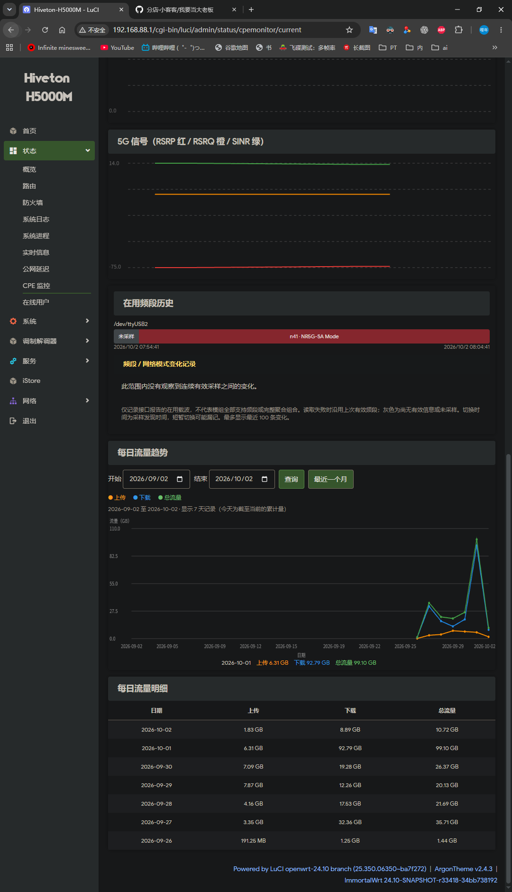
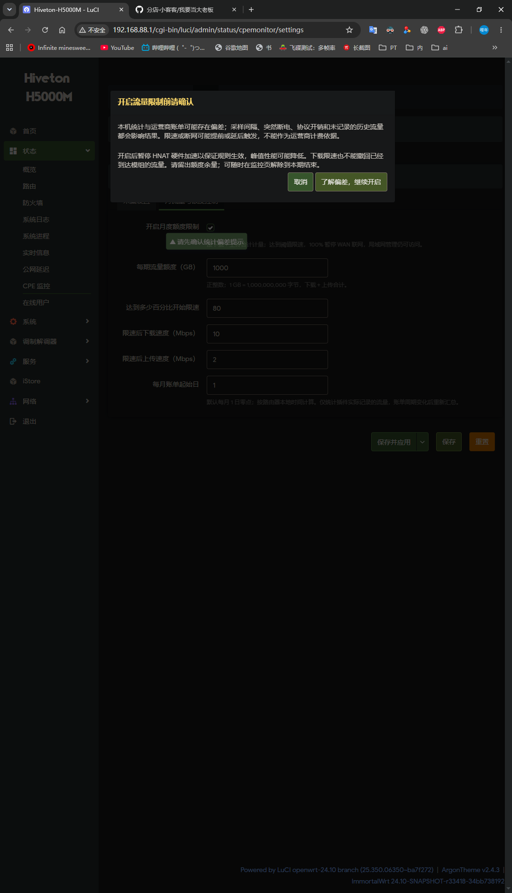
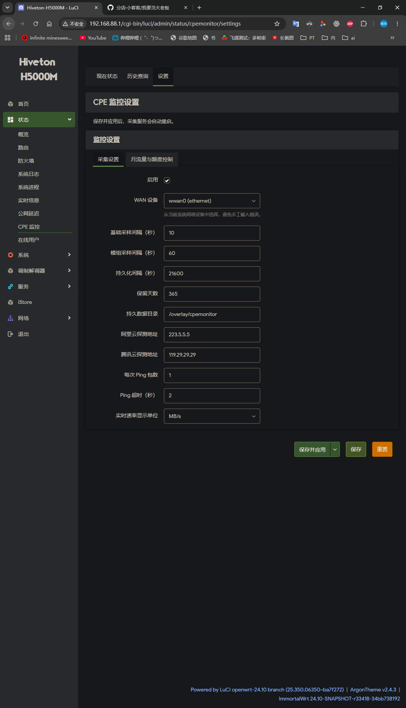

# CPE Monitor for ImmortalWrt — CPE network monitoring plugin

[中文](README.zh-CN.md) | English

A lightweight CPE network monitoring plugin for Hiveton H5000M / ImmortalWrt 24.10. It shows speed, latency, system status, modem signal and bands in one place, and accounts daily traffic. Historical queries and an optional monthly quota control are supported.

Current version: **v1.6.1**. Installers and sources are on [GitHub Releases](https://github.com/xiaokeikei/luci-app-cpemonitor/releases/latest).

## Live monitoring

The monitor page is laid out with speed, network latency, system usage, device temperature and fan, 5G signal, bands in use, daily traffic trend and daily traffic details. Status cards refresh every 10 seconds; charts can switch between the last 10 minutes, 30 minutes, 1/2/5/12 hours or today.



## Bands and traffic statistics

When a band or modem temperature read fails, the last valid value is retained and refreshed on the next successful read; before any valid data is seen the display stays unknown. Band history shows each modem's serving carriers and network mode changes.

The daily traffic trend offers upload, download and total curves, date on the X axis and traffic (GB) on the Y axis. It defaults to the last month; any start and end date can be picked, both inclusive. Hover or touch the chart to inspect a day's value; days without records are not back-filled with zeros.

Today's traffic is the running total so far, and both chart and table refresh every minute. The date picker only controls the traffic trend and is independent of the monitoring time range on top; the table below shows the latest 31 days. The queryable range depends on the retained daily records.



## Metrics

- WAN daily upload, download and total traffic (settled at midnight)
- Live upload/download speed
- CPU, memory, root partition usage and system load
- CPU, Wi-Fi, FM160 modem temperature and fan PWM percentage
- Aliyun/Tencent latency and packet loss
- 5G RSRP, RSRQ, SINR, network mode and bands

Raw samples are first written to `/tmp/cpemonitor` and synced to persistent storage every 6 hours by default to reduce flash wear. Daily traffic state is also checkpointed during sync.

## Installation

Installing or upgrading from the release IPK is recommended:

```sh
opkg install ./luci-app-cpemonitor_1.6.1-1_all.ipk
```

A self-extracting installer is also available: run `sh luci-app-cpemonitor-1.6.1-1.run` (dependencies must be installed first).
If the page still shows an old version after upgrading, press **Ctrl+F5** to force-refresh the browser cache.

After uploading and extracting, run inside the plugin directory:

```sh
chmod +x install.sh
./install.sh
```

LuCI menu: `Status → CPE Monitor`.

The top provides "Current Status", "History" and "Settings" entries; the daily traffic table shows date, upload, download and total.

- `CPE Monitor`: shows the last 10 minutes by default; the title bar switches to the last 30 minutes, 1/2/5/12 hours or today (midnight to now). All charts switch together and auto-refresh keeps the selected range
- `History`: queries by date and start/end time, with automatic downsampling over long spans

The time buttons switch the speed, CPU/memory, temperature/fan, latency and 5G signal charts together.
The "today" range uses browser-local midnight; status cards always show the latest values and the daily traffic table is unaffected by the filter.
Long ranges are downsampled by the backend to about 1200 points; unsampled gaps are not filled.

## Changelog

v1.6.1 adds the daily traffic trend with date selection, retains the last valid bands and modem temperature, reorders the monitor page, and hides the quota section when quota control is disabled. See [CHANGELOG.md](CHANGELOG.md) for the full history.

## Packaging

Run `python tools/build_release.py` (Python 3) in the source directory; artifacts are written to the sibling `versions/` directory, including the IPK, the self-extracting installer, a source ZIP and a SHA256 checksum file.

## Monthly traffic & quota control

Entry: "Settings" at the top → "Monthly quota" tab. Enable "Enable monthly quota limit", acknowledge the accuracy notice, fill in quota, threshold and rates, then "Save & Apply". When disabled, the monitor page hides the monthly traffic and quota section; it can be enabled anytime on the settings page.

- Shows period download, upload, total, quota, remaining and usage percent; based on actually recorded daily counters — unrecorded history cannot be reconstructed.
- The settings page accepts an integer GB quota, throttle threshold (1–99%), download/upload Mbps, and billing day of month (1–28, default 1). 1 GB = 1,000,000,000 bytes.
- At the threshold, tc/TBF + IFB applies bidirectional shaping; at 100% a dedicated nftables table pauses IPv4/IPv6 data on the selected WAN while LAN management stays reachable and DHCP/IPv6 neighbour discovery is preserved.
- The monitor page can lift the limit until period end or resume automatic limiting; the override is stored in the persistent directory, survives reboots and expires automatically next period.
- First-time enabling requires acknowledging in a dialog that local statistics may deviate from carrier billing. Sampling interval, sudden power loss and protocol overhead cause deviation; download throttling cannot retract traffic already received by the modem, so leave quota headroom.
- While control is enabled, cumulative checkpoints are saved every minute and saved immediately on clean stop; a sudden power loss may still lose the last minute. When control is off, the normal persistence interval applies.
- MediaTek HNAT is paused while control is active and restored when control is turned off or the service stops. If firewall flow offloading is enabled or another QoS queue exists on WAN, an error is shown — disable the conflicting feature first.
- Dependencies: tc-tiny, kmod-ifb, kmod-sched-core, nftables-json, BusyBox flock. Limiting is off by default; other WAN devices are unaffected.
- Verified on an H5000M over SSH: WAN bidirectional TBF/IFB queue counters grow, 100% blocking keeps LAN management, instant unlock restores connectivity, and HNAT is restored after disabling.



## Collection settings

Under "Settings → Collection", pick the WAN device, sampling periods, persistent directory, probe hosts and display unit. The collection service restarts automatically after saving and applying.



### Defaults

- Base sampling: 10 seconds
- Modem sampling: 60 seconds (AT/ubus queries are heavy)
- Persistence: 6 hours
- Retention: 365 days
- WAN interface: `wwan0`
- Persistent directory: `/overlay/cpemonitor`

All periods, the interface, probe hosts and retention days can be changed on the LuCI settings page.

## Bands in use recording

The bands and network mode in use at each sample are recorded through the generic modem_ctrl / QModem data interfaces; no modem or band list is hardcoded. NR uses the `n` prefix, LTE `B`, WCDMA `W`. Only serving carriers reported by the interface are recorded; the first reading without information shows unknown, and later read failures keep the last valid bands.

The status card shows the latest bands; the live and history pages show a timeline bar and change log per modem. Secondary carriers are recorded only when the interface reports them — no claim of covering the full aggregation set. Capability lists, locked band lists and neighbour cells are never counted. Grey means no valid information or no sample; on read failure the last valid bands are kept and change times are detection times.

Recording follows the modem sampling period (default 60 seconds), is cached in RAM, saved on the persistence interval and on clean stop; a sudden power loss may lose records not yet persisted. Old data cannot be reconstructed, and band history returns at most the last 5000 observations. Modems without a compatible management interface still get all other monitoring features, but bands show unknown; no vendor AT commands are sent directly. Additional dependencies: ucode, ucode-mod-fs.
